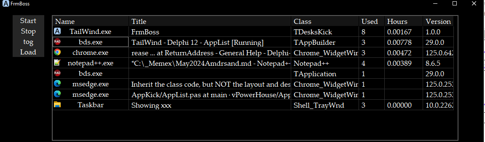

Copyright (c) 2024 Patrick Foley

Using Tailwind SideKick64
==========================



Click on a App to switch to that regardless of the Desktop it's On!

Add a return to TailWind with configure __T__ools under the Tools menu
Just browse for the TailWind.exe to set this up also Notepad++ in the Run menu has similar feature.
install


Explaining  AppList
===================
AppList Updates the UI through timer events
The UI can ChangeState Running Stopped gatherwindows

Hourage Time is reckoned by hour meter rounded to 3 demical places.

GoodApps array of the Executables Classnames we want to track and navigate to.

TApplication is not needed in 64 and doesn't show typically in 32. In saying that, the
Tapplication can catch the GExperts Stand alones.


```
  hour2dot3 ='hr %2.3f ';
  hour2dot3wS ='hr %2.3f %s';

  selfClass = 'TDesksKick';
  //Not necessary
  //TAppClass = 'TApplication';
  GoodApps: Tarray<string> = [ {TAppClass,'TfmGrepResult','TfmPeInformation',} 'Shell_TrayWnd','Notepad', 'TAppBuilder', 'Window',
   'Chrome_WidgetWin_1', 'Notepad++', selfClass ];
//  AppStates: TArray<string> = ['Running','Stopped','Whatnot'];

type

  TappHandles = Tlist<NativeUInt>;

```
Trial and Error
===============
skippers weren't needed.
```
//    Skippers: TArray<string>;
...
//  setlength(Skippers,CXs.Items.Count);
//.. for items if checked
//    else
//      begin
//        Skippers[se] := CXs.Items[I];
//        Inc(se);
//      end;
//  SetLength(Skippers,se);
...
used
//      if IndexText(sClassName, Skippers) >= 0
//          then exit;


```
spared from TptrApp
```
//    AppBuilderCount: Integer;   used if want First started last out
//    popup: TPopupMenu;
//    IconList: TImageList;
junk
      // else
      // Result := 'AbbyNormal Error';   //seen DP for use on other exceptions

            // cut out OpenProcess(PROCESS_ALL_ACCESS, False, inPID)
```

Parts for starting apps
```
//class procedure OpenLocalFile(Path, Params: String);

//function GetDeskTopDirectory: String;
//var
////  PIDL: PItemIDList;
////  LinkName: string;
//  Path: array [0..MAX_PATH-1] of Char;
//begin
////SHGetSpecialFolderLocation    pre Win7
////  SHGetKnownFolderPath
////  (0, CSIDL_DESKTOPDIRECTORY, PIDL);
////  SHGetPathFromIDList(PIDL, InFolder);
//
//  SHGetFolderPath(0, CSIDL_DESKTOP, 0, SHGFP_TYPE_CURRENT, @Path[0]);
//
//end;
//
//
//class procedure TptrApps.OpenLocalFile(Path, Params: String);
//var
//  SEInfo: TShellExecuteInfo;
// // dope: Tarray<string>;
//begin
////  GetAnyRunningDesiredApps(dope);
////  if (Path > '') and FileExists(Path) then begin
////    FillChar(SEInfo, SizeOf(SEInfo), 0);
////    SEInfo.cbSize := SizeOf(TShellExecuteInfo);
////    SEInfo.Wnd := 0;
////    SEInfo.lpFile := PChar(Path);
////    SEInfo.lpParameters := Pchar(Params);
////    SEInfo.nShow := SW_SHOWDEFAULT;
////    SEInfo.lpVerb := 'open';
////    SEInfo.lpDirectory := PChar(ExtractFileDir(Path));
////    ShellExecuteEx(@SEInfo);
////  end;
//end;
```

```

```

**frmMultiDee.pas**
acs 7/7/2023 8:50:42 PM
wrt 4/4/2023 2:38:34 PM
crt 3/21/2023 9:19:45 AM
C:\d113\MultiD\frmMultiDee.pas
